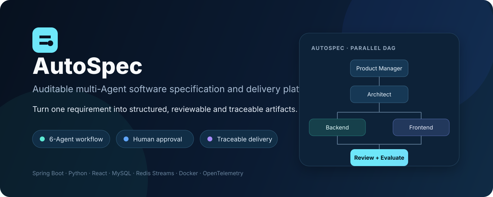
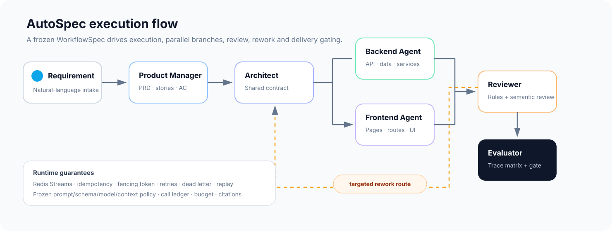
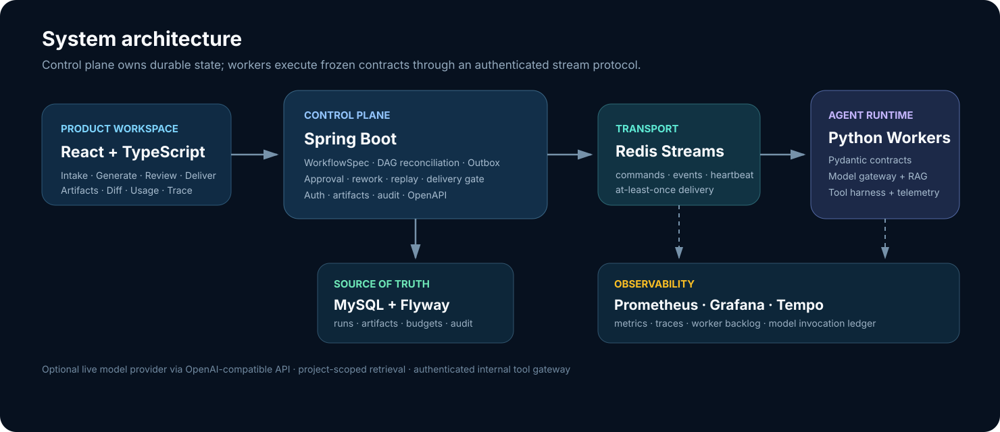

# AutoSpec

**From one software requirement to auditable, reviewable and deliverable engineering artifacts.**

AutoSpec is a multi-Agent software specification and delivery platform. It turns a natural-language requirement into a versioned PRD, architecture, backend design, frontend skeleton, review report, evaluation report and buildable code scaffold, while keeping the entire run traceable and recoverable.

[Quick Start](#quick-start) · [Workflow](#workflow) · [Architecture](#architecture) · [Development](#development) · [Docs](#documentation)

## Why AutoSpec?

Typical LLM coding demos stop at "generate some text." AutoSpec treats generation as an engineering workflow with explicit contracts, durable state and delivery gates.

- **Structured artifacts** — every Agent output is validated by Pydantic / JSON Schema instead of stored as free-form text.
- **Frozen workflow contracts** — workflow topology, prompts, schemas, context policy, model routing and budgets are versioned for reproducible runs.
- **Parallel multi-Agent execution** — Backend and Frontend branches run from the same Architect-owned shared contract and join at review.
- **Human-in-the-loop** — approval, edit-and-approve, rejection and targeted rework are first-class workflow operations.
- **Reliable runtime** — Redis Streams, idempotency, fencing tokens, heartbeat, retry, dead-letter handling, cancellation, recovery and replay.
- **Grounded generation** — project-scoped RAG, citation validation and a controlled read-only tool harness.
- **Evaluation before delivery** — deterministic checks plus semantic review, requirement traceability and hard delivery gates.
- **Operational visibility** — per-call model/tool ledger, token and cost accounting, Prometheus metrics and OpenTelemetry traces.

## Workflow

Fresh databases start from a single Flyway V1 baseline and publish <code>autospec-v5:pm-schema-repair-v12</code>. Retained runs keep their original immutable workflow snapshots. Future database changes start at V2; see the [baseline consolidation record](docs/archive/evidence/baseline-consolidation-2026-09-30.md) before upgrading an older database.

  

The six-node workflow is:

1. **Product Manager** — converts intake into PRD, user stories and acceptance criteria.
2. **Architect** — produces architecture and freezes the shared contract consumed downstream.
3. **Backend Engineer** — designs APIs, data model and backend services.
4. **Frontend Engineer** — designs pages, routes and frontend skeleton in parallel with Backend.
5. **Reviewer** — performs deterministic consistency checks plus model-assisted semantic review.
6. **Evaluator** — builds the traceability matrix and blocks delivery when MUST coverage or severe findings fail.

Reviewer findings can route targeted rework back to Architect, Backend or Frontend without restarting the entire pipeline.

## Architecture

  

| Layer | Responsibility |
| --- | --- |
| <code>frontend/</code> | React + TypeScript + Ant Design workspace for Intake → Generate → Review & fix → Deliver |
| <code>backend/</code> | Spring Boot control plane, MySQL source of truth, auth, DAG reconciliation, approvals, replay, artifacts and delivery gates |
| <code>agent-engine/</code> | Python Agents, Redis Worker runtime, Pydantic contracts, model gateway, RAG, tool harness, review and evaluation |
| Redis Streams | At-least-once command/event transport between the control plane and Workers |
| MySQL + Flyway | Durable workflow state, artifact versions, budgets, audit trail and execution ledger |
| <code>observability/</code> | Prometheus, Grafana and Tempo configuration |

The product entry point is:

~~~http
POST /api/workflow-runs
~~~

The FastAPI process is used for health checks and evaluation/experiment endpoints. Business workflow nodes are executed asynchronously by Redis Workers.

## Core capabilities

### Durable orchestration

- Dynamic DAG execution from immutable WorkflowSpec versions
- Transactional Outbox and idempotent event projection
- Node timeout, retry, dead-letter, recovery and replay
- Cancellation that prevents late Worker events from mutating completed state
- Historical workflow versions retained for deterministic replay

### Artifact lifecycle

- Latest / approved / candidate artifact versions
- Parent and upstream version lineage
- Prompt, schema and model-route provenance
- Field-level diff and restore-as-new-candidate
- Markdown / PDF / ZIP export after delivery gates pass
- Buildable Maven + Vite code scaffold generation

### Agent runtime

- Versioned prompts and structured Pydantic outputs
- Fast / Balanced / Deep model routes
- Per-run token, call, time and estimated-cost budgets
- Project-scoped hybrid retrieval with exact citation metadata
- Controlled tool runtime with declared schemas and policies
- Context manifests for truncation, compression and source tracking

### Review and evaluation

- Deterministic rule checks plus semantic review
- Stable review issue keys with owner, evidence and resolution
- Requirement → story / acceptance → API → data → UI trace matrix
- HIGH / CRITICAL findings and missing MUST coverage block delivery
- Evaluation datasets and a platform-admin read-only A/B/C/D comparison dashboard; missing live evidence stays `NOT_EVALUATED`

## Quick Start

### Prerequisites

- Docker Desktop + Docker Compose
- Or, for local component development: Java 17+, Maven, Python 3 and Node.js 22

### 1. Configure environment

Copy <code>.env.example</code> to <code>.env</code> and provide local secrets:

~~~dotenv
MYSQL_PASSWORD=change-me
MYSQL_ROOT_PASSWORD=change-me
REDIS_PASSWORD=change-me
AGENT_ENGINE_SERVICE_TOKEN=change-me
AUTH_DEMO_USER_PASSWORD=change-me
~~~

Fixture mode is deterministic and does not call an external LLM:

~~~dotenv
AUTOSPEC_ENV=development
AUTH_DEMO_USER_ENABLED=true
AGENT_MODEL_MODE=fixture
AUTOSPEC_EMBEDDING_MODE=fixture
~~~

### 2. Start the stack

~~~powershell
docker compose config --quiet
docker compose up --build -d
docker compose ps
~~~

Open:

- Frontend: <code>http://localhost:5173</code>
- Backend readiness: <code>http://localhost:8080/actuator/health/readiness</code>
- Agent API health: <code>http://localhost:8000/health</code>

To follow the execution path:

~~~powershell
docker compose logs --tail=200 -f backend agent-worker-1 agent-worker-2
~~~

### 3. Five-minute fixture demo

This is a prepared-environment walkthrough of the real browser and Docker
workflow. It uses `AGENT_MODEL_MODE=fixture` and
`AUTOSPEC_EMBEDDING_MODE=fixture`; it does not call an external model and it
does not prove production quality, capacity, cost or SLA.

1. Open the frontend, sign in with the local development account configured by
   `AUTH_DEMO_USER_ENABLED` and `AUTH_DEMO_USER_PASSWORD`, and create a project.
2. Enter a requirement with at least one acceptance criterion and one
   permission rule. A CRUD task list is sufficient for the walkthrough.
3. Open **Generate**, choose the published
   `pm-schema-repair-v12 · #1` workflow, and start a fixture run.
4. In **Agent and approval**, approve the Product Manager artifact with a
   short reason. The formal six-node path is Product Manager → Architect →
   Backend Engineer / Frontend Engineer → Reviewer → Evaluator.
5. Open **Review and fix** and inspect the run Trace: bundle and contract
   hashes, queue/execution time, model/tool counts, step reasons and the
   `SPEC_VERIFY_PASSED` fact. The Evaluator may intentionally stop the fixture
   with `QUALITY_GATE_BLOCKED`; that is a valid negative-gate demonstration,
   not a delivered application.

The demo account is development-only and its password must remain in the
untracked `.env`. Do not disable authentication or delivery gates to make the
demo appear successful. The latest run-specific evidence and known screenshot
capture limitation are recorded in
[`docs/archive/evidence/p2-p4-2026-10-01.md`](docs/archive/evidence/p2-p4-2026-10-01.md).

### 4. Enable a live model

AutoSpec accepts an OpenAI-compatible model endpoint:

~~~dotenv
AGENT_MODEL_MODE=live
MODEL_API_KEY=...
MODEL_BASE_URL=https://your-openai-compatible-endpoint/v1
MODEL_NAME=...
MODEL_FAST_NAME=...
MODEL_DEEP_NAME=...
~~~

Project knowledge embeddings are configured independently:

~~~dotenv
AUTOSPEC_EMBEDDING_MODE=live
EMBEDDING_BASE_URL=https://your-embedding-endpoint/v1
EMBEDDING_API_KEY=...
EMBEDDING_MODEL=...
EMBEDDING_DIMENSIONS=...
~~~

## Repository layout

~~~text
AutoSpec/
├─ backend/                     # Spring Boot control plane
├─ agent-engine/
│  ├─ agents/                   # Product / Architect / Backend / Frontend / Reviewer
│  ├─ runtime/                  # Worker, context, RAG, tools, telemetry
│  ├─ review/                   # Deterministic review + evaluator
│  ├─ schemas/                  # Pydantic contracts
│  └─ contracts/                # Versioned WorkflowSpec files
├─ frontend/                    # React product workspace
├─ observability/               # Prometheus / Grafana / Tempo
├─ performance/                 # k6 scenarios and performance reports
├─ scripts/                     # Contract and release verification
├─ docs/                        # Current task and archived reference material
└─ docker-compose.yml           # Full local topology
~~~

## Development

### Backend

~~~powershell
cd backend
mvn spring-boot:run
~~~

### Agent Engine

~~~powershell
cd agent-engine
python -m pip install -r requirements.txt
python -m pytest -q
~~~

### Frontend

~~~powershell
cd frontend
npm ci
npm run dev
~~~

## Verification

Run the release-oriented checks after cross-module contract, schema, dependency or database changes:

~~~powershell
cd backend
mvn test

cd ../agent-engine
python -m pytest -q

cd ../frontend
npm test
npm run build

cd ..
python scripts/verify_workflow_contract.py
docker compose config --quiet
docker compose --profile monitoring config --quiet
~~~

The GitHub Actions quality workflow additionally runs integration checks and builds the application images.

## Reliability and security boundaries

- Browser sessions use <code>HttpOnly</code> cookies and production configuration fails closed on insecure settings.
- Redis and internal Agent traffic are authenticated.
- Published ports bind to localhost by default in the development Compose topology.
- Retrieval is scoped to the current project and citation references are validated.
- Production rejects fixture model mode, demo login, root database users and missing security configuration.
- Secrets remain environment-only; prompts, workflow contracts, events and logs never need to contain API keys.

## Observability

The optional monitoring profile provides:

- **Prometheus** for runtime and backlog metrics
- **Grafana** dashboards
- **Tempo** distributed tracing
- persisted node/model/tool execution metadata for drill-down diagnostics

Start it with:

~~~powershell
docker compose --profile monitoring up --build -d
~~~

## Documentation

- [Current task: Spec Sandbox](docs/autospec-v5-spec-sandbox-plan.md)
- [P0 / P1 execution guide](docs/p0-p1-execution-plan.md)
- [Archived documentation and evidence](docs/archive/README.md)

## Contributing

Issues and pull requests are welcome. When changing OpenAPI, WorkflowSpec, database migrations or cross-language schemas, update the corresponding consumers, tests and documentation together.

Use Conventional Commits where possible:

~~~text
feat: add workflow approval
fix: reject stale worker event
refactor: consolidate autospec v5 runtime
docs: improve local startup guide
test: cover evaluator delivery gate
~~~

---

  AutoSpec · auditable multi-Agent engineering from requirement to verified delivery.

